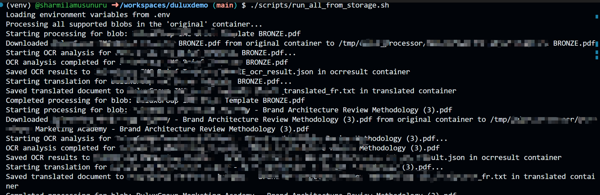

#  Demo - Document Intelligence and Translator

This project demonstrates Azure Document Intelligence (OCR) and Azure Translator services for processing documents in multiple formats (PDF, DOCX, PPTX). The solution extracts text using OCR and translates it from English to French.

## Architecture

The solution consists of:

1. **Infrastructure (Terraform)**: Creates Azure resources
   - Azure Storage Account with three containers:
     - `original`: Store source documents
     - `translated`: Store translated text files
     - `ocrresult`: Store OCR results in JSON format
   - Azure Document Intelligence (Form Recognizer): For OCR functionality
   - Azure Translator: For text translation (English to French)

2. **Application (Python)**: Processes documents
   - Uploads documents to Azure Storage
   - Performs OCR using Document Intelligence
   - Translates extracted text using Translator API
   - Saves results to appropriate containers

## Prerequisites

- [Terraform](https://www.terraform.io/downloads.html) >= 1.0
- [Python](https://www.python.org/downloads/) >= 3.8
- [Azure CLI](https://docs.microsoft.com/en-us/cli/azure/install-azure-cli)
- Azure subscription

## Setup Instructions

### 1. Deploy Infrastructure with Terraform

```bash
# Login to Azure
az login

# Navigate to terraform directory
cd terraform

# Initialize Terraform
terraform init

# Review the deployment plan
terraform plan

# Deploy resources (customize variables as needed)
terraform apply -var="storage_account_name=youruniquestoragename"

# Note the outputs - you'll need these for the Python application
terraform output
```

To get sensitive outputs:
```bash
terraform output -json > terraform_outputs.json
```

### 2. Configure Python Application

```bash
# Create a virtual environment
python -m venv venv

# Activate virtual environment
# On Windows:
venv\Scripts\activate
# On Linux/Mac:
source venv/bin/activate

# Install dependencies
pip install -r requirements.txt

# Copy environment template
cp .env.example .env

# Edit .env with your Azure resource values from Terraform outputs
```

Update `.env` file with values from Terraform:
```env
DOCUMENT_INTELLIGENCE_ENDPOINT=<from terraform output>
DOCUMENT_INTELLIGENCE_KEY=<from terraform output>
TRANSLATOR_ENDPOINT=<from terraform output>
TRANSLATOR_KEY=<from terraform output>
TRANSLATOR_LOCATION=<from terraform output>
STORAGE_CONNECTION_STRING=<from terraform output>
DOCUMENT_PATH=path/to/your/document.pdf
```

### 3. Run the Application

```bash
# Process a document
python src/document_processor.py
```

### 4. Run against files in Azure Storage (recommended)

This project supports processing documents that are already uploaded to the `original` container in the Storage Account. The processor will perform OCR, translate the extracted text, save OCR JSON to the `ocrresult` container and save both TXT and PDF translations to the `translated` container.

Use the supplied helper script to process all supported blobs in `original`:

```bash
# Ensure venv and .env are configured
source venv/bin/activate
# Load env vars from .env
set -a; source .env; set +a
./scripts/run_all_from_storage.sh
```

Or run the processor directly from Python (process all blobs):

```bash
python -c "from src.document_processor import DocumentProcessor; DocumentProcessor().process_document(from_storage=True)"
```

To process a single blob by name:

```bash
BLOB_NAME=invoice1.pdf python -c "from src.document_processor import DocumentProcessor; DocumentProcessor().process_document(from_storage=True, blob_name='invoice1.pdf')"
```

Notes:
- The code will generate a short-lived SAS for each blob when possible (requires STORAGE_CONNECTION_STRING with AccountKey). If you supply a SAS-only connection string (portal-produced), the processor will append that SAS to each blob URL so OCR can access the file until the SAS expires.
- Supported file formats: PDF, DOCX, PPTX. Unsupported files in the container are skipped.

## Usage Examples

### Processing Different Document Formats

```python
from src.document_processor import DocumentProcessor

processor = DocumentProcessor()

# Process PDF
processor.process_document("documents/sample.pdf")

# Process DOCX
processor.process_document("documents/report.docx")

# Process PPTX
processor.process_document("documents/presentation.pptx")
```

### Output Structure

After processing, you'll find:

1. **Original Container**: Original uploaded documents
2. **OCRResult Container**: JSON files with OCR results
   - Contains extracted text with page numbers and coordinates
   - Example: `document_name_ocr_result.json`
3. **Translated Container**: Translated text files
   - Contains French translation of extracted text
   - Example: `document_name_translated_fr.txt`
  - Also contains rendered PDF versions of the translated document
    - Example: `document_name_translated_fr.pdf`

### Sample OCR Result Format

```json
{
  "file_name": "sample.pdf",
  "pages": [
    {
      "page_number": 1,
      "width": 8.5,
      "height": 11.0,
      "unit": "inch",
      "lines": [
        {
          "content": "Sample text content",
          "polygon": [{"x": 1.0, "y": 2.0}, ...]
        }
      ]
    }
  ],
  "full_text": "Complete extracted text..."
}
```

## Features

- ✅ Multi-format document support (PDF, DOCX, PPTX)
- ✅ OCR text extraction with position information
- ✅ English to French translation
- ✅ Automatic chunking for large documents
- ✅ Azure Blob Storage integration
- ✅ Infrastructure as Code with Terraform
- ✅ Organized storage structure

## Project Structure

```
aidemo/
├── terraform/
│   ├── main.tf          # Main infrastructure configuration
│   ├── variables.tf     # Configurable variables
│   └── outputs.tf       # Resource outputs
├── src/
│   └── document_processor.py  # Main application logic
├── requirements.txt     # Python dependencies
├── .env.example        # Environment variables template
├── .gitignore          # Git ignore rules
└── README.md           # This file
```

## Configuration Variables

### Terraform Variables

You can customize the following variables in `terraform/variables.tf`:

- `resource_group_name`: Name of the Azure resource group
- `location`: Azure region (default: eastus)
- `storage_account_name`: Storage account name (must be globally unique)
- `document_intelligence_name`: Document Intelligence service name
- `translator_name`: Translator service name
- `environment`: Environment tag

### Environment Variables

Required environment variables in `.env`:

- `DOCUMENT_INTELLIGENCE_ENDPOINT`: Endpoint URL for Document Intelligence
- `DOCUMENT_INTELLIGENCE_KEY`: API key for Document Intelligence
- `TRANSLATOR_ENDPOINT`: Endpoint URL for Translator service
- `TRANSLATOR_KEY`: API key for Translator service
- `TRANSLATOR_LOCATION`: Azure region for Translator service
- `STORAGE_CONNECTION_STRING`: Connection string for Storage Account
- `DOCUMENT_PATH`: (Optional) Path to document to process

## Cleanup

To destroy all Azure resources created by Terraform:

```bash
cd terraform
terraform destroy
```

## Troubleshooting

### Common Issues

1. **Storage account name already exists**: Change the `storage_account_name` variable to a unique value
2. **Authentication errors**: Ensure you're logged in with `az login` and have proper permissions
3. **Quota limits**: Check your Azure subscription quotas for Cognitive Services
4. **File format errors**: Ensure documents are in supported formats (PDF, DOCX, PPTX)

## Cost Considerations

- **Storage Account**: Pay-as-you-go based on storage and transactions
- **Document Intelligence**: S0 tier pricing applies
- **Translator**: S1 tier pricing applies

Review [Azure pricing](https://azure.microsoft.com/en-us/pricing/) for current rates.

## Security Notes

- Never commit `.env` files or credentials to version control
- Use Azure Key Vault for production deployments
- Enable Private Endpoints for Storage Accounts in production
- Rotate API keys regularly

## License

This is a demonstration project.




